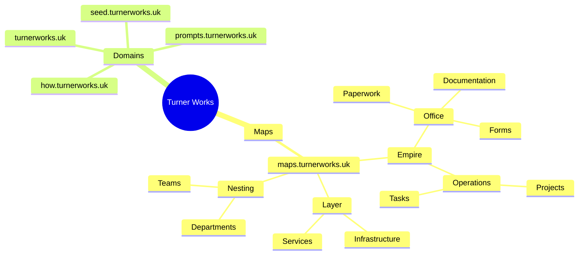

# turner-works-empire
Turner Works company structure - Empire, Layer, Nesting architecture with Mermaid diagrams

## Company Structure

## URL Structure

The Maps subdomain follows this hierarchical structure:

- `maps.turnerworks.uk/empire/office/paperwork`
- `maps.turnerworks.uk/empire/office/documentation`
- `maps.turnerworks.uk/empire/operations/projects`
- `maps.turnerworks.uk/layer/infrastructure`
- `maps.turnerworks.uk/nesting/departments`
